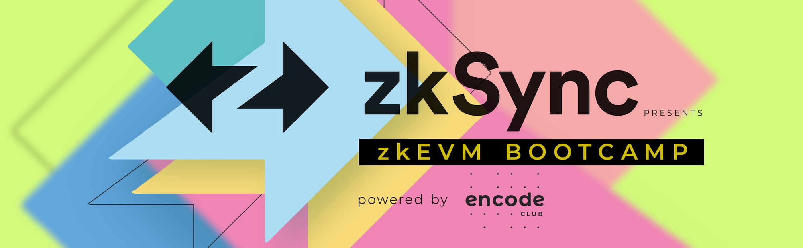

# zkEVM Bootcamp | zkSync

- L1 consensus mechanisms and data availability
- L2 fundamentals (agnostic lifecycles, criteria for comparisons)
- Analysis of major zkEVM implementations
- Advanced L2 topics (decentralized sequencers, privacy, hyperchains)
- Architecting a zkEVM system, including writing Rust circuits
- Advanced ZK-proof topics, such as ML and formal verification