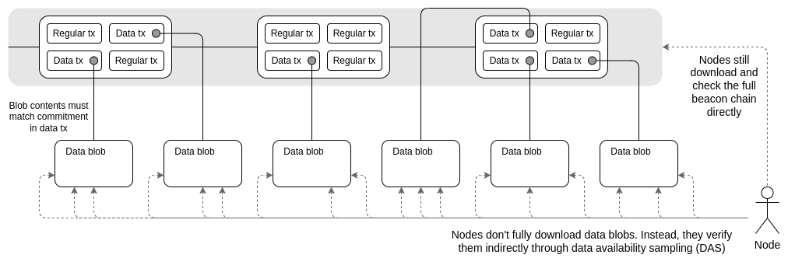

# Week 1 - Background / Scalability

## **`w1.d1` - Intro to L1**

---
*Ref*

- [Docs](https://encodeclub.notion.site/zkSync-presents-zkEVM-Bootcamp-powered-by-Encode-66ea856029374655b850d5dfe4e8f7ca)
- [Exemption Form](https://airtable.com/appfmhpRJGEJKiY6E/shr39564LsKGe6xft)
- [Proofs, Arguments, and Zero-Knowledge](https://people.cs.georgetown.edu/jthaler/ProofsArgsAndZK.html)
- [The Rust Programming Language](https://doc.rust-lang.org/book/)
- [Modular Blockchains: A Deep Dive](https://volt.capital/blog/modular-blockchains)
- [Episode 268: A Rollup-Centric Future & Sovereign Chains with Mustafa Al-Bassam](https://zeroknowledge.fm/268-2/)

---
---

## **`w1.d2` - Why Scalability**

- Do the computation, then create the proof along side that, send the proof from L2 to L1
- Validity rollups are not private
  - Its about correctness of computation
- Optimistic rollups, do NOT create a proof at the time of the executions, only after a fraud proof can be used to reorg the state on L2

## BFT

- Can have a negative impact on scalability
- As the number of validators increases, the amount of messages being passed increases
- On Ethereum, validators form committees and votes are aggregated by committee

> Ethereum transactions are ordered by the block producer and then executed sequentially

- Cons are MEV and poor horizontal scaling

## State Channels

- Only require two transactions on the L1 blockchain, one at the start and one at the end
- Must lock a portion of Ethereum's state, like an ETH deposit, into a multisig contract
- Participants can transact quickly and freely off-chain
- When the interaction is finished,, a final on-chain transaction is submitted, unlocking the state

## Lighting

- Funds are placed into a two-party, multi-signature "channel" bitcoin address
  - This channel is represented as an entry on the bitcoin public ledger
- In order to spend fund from the channel, both parties must agree on the new balance
  - The current balance is stored as the most recent transaction signed by both parties, spending from the channel address
- To make a payment, both parties sign a new exit transaction spending from the channel address
  - All old exit transactions are invalidated by doing so
- The Lightning Network does not require cooperation from the counter-party to exit the channel
- Both parties have the option to unilaterally close the channels, ending their relationship
- Since all parties have multiple multi-signature channels with many different users on this network, one can send a payment to any other party across this network
- Payments are instant and atomic

## Plasma

- Blockchains anchored to Ethereum's main chain
- Utilize fraud proofs to resolve disputes, like Optimistic rollups
- Using Merkle trees, these chains can be stacked indefinitely
- Their security hinges on fraud proofs, and each has a unique block validation method
- The operator is obliged to periodically post "state commitments" on Ethereum in the form of "Merkle roots", sent to the Plasma contract on Ethereum

## Rollups

> Batched transactions on a separate blockchain and uses proofs to ensure the **truthfulness of transactions.**

- Data or proof of transactions on L1
- a rollup smart contract on L1 that can enforce transaction execution on L2 by using the transaction data on L1
- "Operators" to stake a bond in the rollup contract

## ZKPs

- Rely on a proof of the correctness of the execution that produces the rollup block state transition being supplied to a validator contract on L1
- A state transition on L2 will not be regarded as valid unless the proof has been validated
- Refereed to as **validity proofs** because the focus is on the correctness of computation

### SNARKs vs. STARKs

#### SNARKs (**S**uccint **N**on-interactive **AR**gument of **K**nowledge)

- SNARKs create small, quickly verifiable arguments of knowledge (i.e. computationally sound cryptographic proofs) that don’t need additional information beyond the proof itself
- SNARKs are transparent because they can use publicly verifiable randomness to set up interactions between provers and verifiers instead of relying on a more centralized, trusted setup

#### STARKs (**S**calable **T**ransparent **AR**gument of **K**nowledge)

- STARKs are scalable because their **proofs scale linearly**, while SNARK proofs only scale quasilinearly
- Because of this, STARKs are preferred for larger transactions

## Optimistic Proofs

- Aggregators publish only the bare minimum information with no proofs, assuming the aggregators run without committing fraud, and only providing proofs in a case of fraud
- Uses **fraud proofs**

### Single vs. Multi-Round

#### Single Round (Optimism)

- When a verifier submits a fraud proof to challenge a transaction on Optimism, the entirety of the proof is run on the EVM, which is a relatively quick and easy process that is only limited by the dispute time delay (DTD) of one week

#### Multi-Round (Arbitrum)

- Arbitrum’s fraud proof verification process relies on an interactive off-chain dispute verification process where the asserter and challenger repeatedly narrow down sections of the transaction in multiple rounds until they find a section where they disagree

## Validity (ZK) Proofs vs. Fraud Proofs

### **Validity Proofs**

#### Verification Method between

1. Prover $\to$ someone who is creating a proof for some information
2. Verifier $\to$ someone who verifies the proof with no information shared between the two

- The information shared between a prover and a verifier is called a **witness**
- The prover needs to show they know the witness accurately
- The verifier needs to be able to reliably ascertain whether the prover has knowledge of the witness

### Polynomial Commitments - The cryptographic technique of a Validity Proof

- Information from each step of a verification computation is encoded in polynomials
- A factored polynomial expression can stand in for a large number of equations between numbers

#### Hashing Schemes for Polynomial Commitments

1. KZG (Kate) Polynomial Commitments
2. Bulletproofs
3. FRIs (**F**ast **R**eed-Solomon **I**nteractive Oracle Proofs of Proximity)

### **Fraud Proofs**

- AKA a **fault proof**, is a proof submitted by a verifier that challenges a transaction state
- These work by comparing Merkle roots and verifying the beginning and end state roots through either a single round of computation (like Optimism) or multi-round computation (like Arbitrum)

## How are validity and fraud proofs different?

### 1. Validity Proofs Are More Computationally Intensive Than Fraud Proofs

- Fraud proofs are typically cheaper per batch, at around 40,000 gas, while ZK SNARK proofs require 500,000 gas
- However ZK SNARKs are cheaper on-chain because optimistic rollups need to publish all data back to the main blockchain for a fraud proof to legitimize or disprove a result

### 2. Validity Proofs Are Instant, While Fraud Proofs Have a Dispute Time Delay

### 3. Validity Proofs Are More Decentralized and Data Secure

### 4. Validity Proofs Are Harder to Implement


### Recursive Proofs

- Work by proving multiple transactions blocks at a time and then proving an aggregated block as well
- SNARKs are proving other SNARKs, resulting in one final transaction at the end which is even more efficient than multiple, rolled-up transactions

> Polygon’s Polygon Zero uses **Plonky2** to create these recursive proofs, and it is the *fastest* proving scheme currently available.

### Validum's

- A type of ZK rollups where all of the **data is stored off-chain**
- Need to use Data Availability Committees (DAC) to provide neutral and honest data storage

---
*Ref:*

- [Why blockchain performance is hard to measure](https://a16zcrypto.com/posts/article/why-blockchain-performance-is-hard-to-measure/)
- [Why sharding is great: demystifying the technical properties](https://vitalik.ca/general/2021/04/07/sharding.html)
- [Ethereum Sharding: Overview and Finality](https://medium.com/@icebearhww/ethereum-sharding-and-finality-65248951f649)
- [The Limits to Blockchain Scalability](https://vitalik.ca/general/2021/05/23/scaling.html)
- [Validity (ZK) Proofs vs. Fraud Proofs](https://www.alchemy.com/overviews/validity-proof-vs-fraud-proof#:~:text=What%20is%20a%20validity%20proof,information%20shared%20between%20the%20two.)

---
---

## **`w1.d3` - Into to L2s**

## zkEVM

- A VM designed to emulate the EVM by recreating all EVM opcodes
- Acts as a state machine, processes state transitions stemming from the execution of Ethereum's L2 transactions
- Generates **validity proofs** that confirm the accuracy of the off-chain state change computations

### Two ways to build general dApps in zk Rollups

1. Build application-specific circuit ("**ASIC**") for different dApps

- Every dApp would benefit from reduced overhead due to this bespoke circuit design
- Leads to comparability issues

2. Build an **universal EVM circuit** for smart contract execution

- Circuit refers to the program representation used in a zero knowledge proof

## The EVM Architecture


- EVM is a stack based VM (`32 bytes` wide) vs a registered stack based VM
- The opcode of the EVM needs to interact with Stack, Memory and Storage during execution
- Stack is only used for Stack access
- Memory and Storage can be accessed randomly

> a zkEVM would seek to emulate all of these components and their interactions and create proofs that the interactions were correct

### PLONK

- **Elliptic Curves** - used as digital signatures utilized in every single Ethereum transaction
- Elliptic Curve **Pairings** -  Used in BLS signatures, which used with Account abstraction are being leveraged to build new Smart Wallets
- Polynomial **Commitment Schemes** - Utilized in Verkle Trees, which are planned to replace Merkle trees
- Use the above to create **zk-SNARKs** - Build privacy features even on public blockchains
- **Recursive Proofs** - power zkRollups and privacy enabled blockchains
- Combine it all with **Arithmetization** - build zkEVMs

---

## Data Availability Solutions

**Data Availability Sampling (DAS)** is a way for the network to check that data is available without putting too much strain on any individual nodes

- Each node downloads some small, randomly selected subset of the total data

**Data Availability Committees (DAC)** are trusted parties that provide, or attest to, data availability

- The security guarantees that come with committees depends on the specific set up

---

## Proto Danksharding

### EIP-4844

- Implement a new transaction type that will hold an additional data field called a blob
- Uses temporary data blobs, not accessible to the EVM and deleted after 1-3 months
- A blob can be considered an opaque `byte` `string` up to `~125 kB` in size
- Blobs will be stored only in the consensus layer (Beacon nodes), and future developments won't require interaction with the execution later (EVM)
- Aim for a long-term data usage of approx `1 MB` per slot (every 12 secs) compared to a potential `16 MB`, due to the need for validators and clients to download full blob contents
- L2 solutions can access and query data more efficiently and affordably than with calldata
- Rollups will post their transaction data in these blobs, along with a commitment to the data, typically created by fitting a polynomial function to the data
- Validators will be able to process both L1 execution and blobs
- There will be seperate fee markets for both of these sets of data

#### Blob-carrying Transaction

- New kind of transaction, which is similar to standard transactions but includes an additional, large data segment know as a blob
- A new type of vehicle where rollups can park transactions and proof data efficiently
- blobs cannot be accessed in the EVM



---
*Ref:*

- [rustup](https://rustup.rs/)
- [Data Availability EF](https://ethereum.org/en/developers/docs/data-availability/)
- [PLONK by Hand (Part 1: Setup)](https://research.metastate.dev/plonk-by-hand-part-1/)
- [Cairo's public memory](https://www.cryptologie.net/article/603/cairos-public-memory/)
- [Why and How zk-SNARK Works](https://arxiv.org/abs/1906.07221)
- [Pairings for beginners](https://static1.squarespace.com/static/5fdbb09f31d71c1227082339/t/5ff394720493bd28278889c6/1609798774687/PairingsForBeginners.pdf)
- [Elliptic Curve Cryptography: a gentle introduction](https://andrea.corbellini.name/2015/05/17/elliptic-curve-cryptography-a-gentle-introduction/ "Elliptic Curve Cryptography: a gentle introduction")
- [Welcome to Comprehensive Rust 🦀](https://google.github.io/comprehensive-rust/#welcome-to-comprehensive-rust-)
- [Benchmarking ZK-Circuits in Circom](https://eprint.iacr.org/2023/681.pdf)
- [KZG polynomial commitments](https://dankradfeist.de/ethereum/2020/06/16/kate-polynomial-commitments.html)
- [The Cambrian Explosion of Crypto Proofs](https://medium.com/starkware/the-cambrian-explosion-of-crypto-proofs-7ac080ac9aed)

---
---

## **`w1.d4` ⋅  Math & Cryptography**

## Fully Homomorphic Encryption

- "Holy grail" of cryptography
- Allows arbitrary computations on encrypted data without access to the secret key
- Extension of either symmetric-key or public-key cryptography

> Homomorphic refers to homomorphism in algebra: the encryption and decryption functions can be thought as homomorphisms between plaintext and ciphertext spaces

[fhEVM from Zama.ai](https://www.zama.ai/fhevm)
[Rand Hindi: Zama - Fully Homomorphic Encryption in Blockchain Applications & Privacy](https://epicenter.tv/episodes/523)

### Verifiable Random Functions (VRF)

- A cryptographic primitive that maps inputs to verifiable pseudorandom outputs
- Ideal to find block producers in a blockchain in a **trustless verifiable way**

### Verifiable Delay Functions

- A way to show that some time or some amount of computation has happened

### Numbers and Terminology

The set of **Integers** is denoted by `Z` e.g. `{⋯,−4,−3,−2,−1,0,1,2,3,4,⋯}`

The set of **Rational Numbers** is denoted by `Q` e.g. `{...1, 3/2 , 2, 22/7...}`

The set of **Real Numbers** is denoted by `R` e.g. `{2, −4, 613, π, √2, …}`

## Field

- A field is a set of say Integers together with **two operations called addition and multiplication**
- Denoted by `F`
- If they are finite field or `K` for a field of real or complex numbers we also use Z∗p to represent a finite field of integers mod prime `p` with multiplicative inverses
- Every finite field has a generator
- A generator is capable of generating all of the elements in the set by exponentiating the generator

### Field axioms

In these axioms, `a`, `b` and `c` are arbitrary elements of the field `F`:

1. **Associativity of addition and multiplication**:

```text
a + (b + c) = (a + b) + c
and
a • (b • c) = (a • b) • c
```

2. **Commutativity of addition and multiplication**:

```text
a + b = b + a 
and
a • b = b • a
```

3. **Additive and multiplicative identity**: there exist two different elements `0` and `1` in `F` that:

```text
a + 0 = a
and
a • 1 = a
```

4. **Additive inverses**: for every `a` in `F`, there exists an element in `F`, denoted `−a`, called the additive inverse of `a`, such that `a + (−a) = 0`

5. **Multiplicative inverses**: for every `a ≠ 0` in `F`, there exists an element in `F`, denoted by $a^-1$, called the multiplicative inverse of `a`, such that a • $a^-1$ = 1

6. **Distributivity of multiplication over addition**:

```text
a • (b + c) = (a • b) + (a • c)
```

### Finite Fields

- A field with a finite set of elements, such as the set of integers $\mod p$ where $p$ is a prime.
- The **order** of the field is the number of elements in the field's set
- For a finite field the order must be either:
  - prime (a prime field)
    - the power of a prime (an extension field)
- Every finite field has a generator

#### Generator

- A generator is capable of generating all of the elements in the set by exponentiating the generator
- So for generator $g$ we can take $g^0$, $g^1$, $g^2$ and eventually this will give us all elements in the group
- For example, taking the set of integers and prime `p` = `5`, we get the group `Z*5 = {0,1,2,3,4}`
- Operations are carried out modulo `5`
  - Thus, we don't have `3 x 4 = 12`, but instead have `3 x 4 = 2`, because `12 mod 5 = 2`
    - This group is cyclic and has two generators, `2` and `3` because:
      - $2^{1}=2$ or `2 mod 5 = 2`
		- $2^{2}=4$ or `4 mod 5 = 4`
        - $2^3=3$ or `8 mod 5 = 3`
		- $2^4=1$ or `16 mod 5 = 1`
		- AND
		- $3^1=3$ or `3 mod 5 = 3`
		- $3^2=4$ or `9 mod 5 = 3`
		- $3^3=2$ or `27 mod 5 = 2`
		- $3^4=1$ or `81 mod 5 = 1` 
- In a finite field of order $q$, the polynomial $X^{q}-X$ has all $q$ elements of the finite field as roots

## Modular Arithmetic

- Sometimes called "clock math"
- When we write `n mod k`, we mean the remainder when `n` is divided by `k`

```text
25 mod 3 = 1
```

- The reminder should be positive

## Group Theory

- A group is a set of elements `{a,b,c,...}` plus a binary operation `•`
- A group needs to have certain properties:

 1. **Closure** -> For all `a`,`b` in `G`, the result of the operation,  `a • b`, is also in `G`
 2. **Associativity** -> For all `a`,`b` and `c` in `G`, `(a • b) • c = a • (b • c)`
 3. **Identity element** -> There exists an element `e` in `G` such that, for every element `a` in `G`, the equation `e • a = a • e = a` holds
 4. **Inverse element** -> For each `a` in `G`, there exists an element `b` in `G`, commonly denoted `a^−1` (or `−a`, if the operation is denoted "+"), such that `a • b = b • a = e`, where `e` is the identity element

## Group Homomorphisms

- A map between two algebraic structures of the same type, that preserves the operations of the structures
- This means a map $f$ : $A \to B$ between two groups $A$, $B$ equipped with the same structure such that:

if `•` is an operation of the structure (here a **binary operation**), then:

```latex
f(x • y) = f(x) • f(y)
```

## Equivalence Classes

Since:

- `6 mod 7 = 6`
- `13 mod 7 = 6`
- `20 mod 7 = 6`
We can say:
- `6,13,20`... is an **equivalence class**

> Modular arithmetic partitions the integers into $N$ equivalence classes

## Polynomials

- Polynomials are a single mathematical object that can contain an unbounded amount of information (this of them as a list of integers and this is obvious)
- A single equation between polynomials can represent an unbounded number of equations between numbers.
- An expression that can be built from constants and variables by means of addition, multiplication and exponentiation to a non-negative integer power:
$$3x^2+4x+3$$

> Polynomials are efficient way to encode information. So the state of the program can be encoded by polynomials. So when we are generating a proof, we encode state of the program, later using compressing techniques we can reduce this information to a small proof and send it to the verifier.

### Representations

#### Two ways to represent polynomials

1. Coefficient form:
$$f(x)=a_0+a_1x+a_2x^2+a_3x^3...$$
2. Point value form:
$$(x_1,y_1),(x_2,y_2),...$$

### When two(2) polynomials are equal

1. They evaluate to the same value or all points
2. They have the same coefficients

## Complexity Theory

- Looks at the time or space requirements to solve a problem, particularly in terms of the size of the input.
- Based on the size of the input $n$, we classify problems according to how the time required to find a solution grows with $n$

### Complexity Classes


$P$

$P$ is a complexity class that represents the set of all decisions problems that can be solved in polynomial time. That is, given an instance of the problem, the answer yes or no can be decided in polynomial time.

$NP$

$NP$ is a complexity class that represents the set of all decision problems for which the instances where the answer is "yes" **have proofs** that can be verified in polynomial times, even though the solution may be hard to find.

$NP-Complete$

$NP-Complete$ is a complexity class which represents the set of all problems $X$ in $NP$ for which it is possible to reduce any other $NP$ problem $Y$ to $X$ in polynomial time.

- Everything in NP is provable in ZK

$NP-Hard$

$NP-Hard$ problems do not have to be in $NP$, and they do not have to be decision problems.

## Big O Notation

- Describes the **complexity** of your code using algebraic terms
- Describes the time or space required to solve a problem in the worse case in terms of the size of the input

> We use Big O notation when comparing ZKP systems


## Zero Knowledge Proofs

- It is a proof that there exists or that we know something, plus a zero knowledge aspect, that is the person verifying the proof only gains one piece of information - that the proof is valid or invalid.

### Players in ZKPs

1. Creator (optional)
2. Prover (Peggy)
3. Verifier (Victor)

> "You can make a proof for the statement "I know a secret number such that if you take the word ‘cow', add the number to the end, and `SHA256` hash it 100 million times, the output starts with `0x57d00485aa` ". The verifier can verify the proof far more quickly than it would take for them to run 100 million hashes themselves, and the proof would also not reveal what the secret number is." - Vitalik Buterin

### Proving Systems

A statement is a proposition we want to prove, which depends on:

- Instance variables, which are public
- Witness variables, which are private

What do we require of a proof?

1. **Completeness** - there is an honest prover P that can convince the honest verifier V of any correct statement with very high probability
2. **Soundness** - Even a dishonest prover P running in super-polynomial time cannot convince an honest verifier V of an incorrect statement

> A ZKP is nothing more than a sequence of numbers, carefully computed by Peggy, together with a bunch of boolean checks that Victor can run in order to verify the roof of correctness for the computation

### Interactive vs. Non Interactive Proofs

Non-interactivity is only useful if we want to allow multiple independent verifiers to verify a given proof without each one having to individually query the prover.

- There is no repeated communication between the prover and the verifier
- Only a **single "round"**, which can be carried out **asynchronously**
- Peggy produces a proof, and publishes it in a place accessible by Victor (distributed ledger)
- At any time, Victor can verify that proof to complete the "round"
- Anyone can verify the proof statement

Interactive proofs are multiple proofs

### Succint vs. Non Succint

- Succinctness is necessary only if the medium used for storing the proofs is very expensive and/or if we need very short verification times

> **Succint** -> clear, precise expression in few words; concise and terse
>
> - *bound*
> - *close-fitting*
> - *compact*
> - *compressed*

---
*Ref*

- [Analysis of Algorithms | Big-O analysis](https://www.geeksforgeeks.org/analysis-algorithms-big-o-analysis/)
- [What is modular arithmetic?](https://www.khanacademy.org/computing/computer-science/cryptography/modarithmetic/a/what-is-modular-arithmetic)
- [Finite Fields](https://asecuritysite.com/encryption/finite)
- [Lecture A.1: Introduction to Interactive Proofs](https://www.youtube.com/watch?v=pMzpQ82Q88Q)
- [Privacy-preserving statistical and machine learning methods under fully homomorphic encryption](https://ora.ox.ac.uk/objects/uuid:a081311c-b25c-462e-a66b-1e4ac4de5fc2/)

---
---
