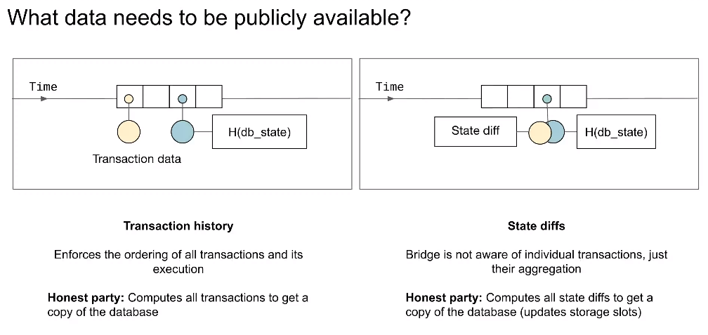
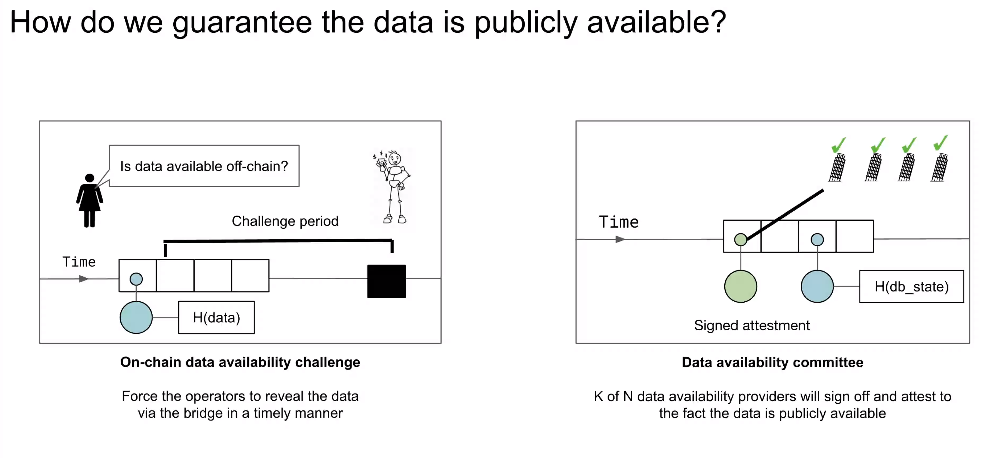

# Week 2 - L2 Fundamentals

## **`w2.d1` - Criteria for Understanding and Analyzing L2s**

## L2 Theory

### Generalized L2s

Anything possible on Ethereum L1, should be transferable to L2

#### Examples:

- [Arbitrum](https://arbitrum.io/) 
- [Optimism](https://www.optimism.io/)
- [Boba](https://boba.network/)
- [Starknet](https://www.starknet.io/en)

### Application Specific L2s

Optimized for specified application space

#### Examples:

- [Loopring](https://loopring.org/#/)
- [zkSync](https://zksync.io/)
- [ZK Space](https://www.zks.org/)
- [Aztec](https://aztec.network/) 

## Modular Rollup Theory

### Three Primary Layers

#### 1) Consensus

**Data Availability (DA)**

- Ethereum blocks/calldata
- EIP 4844
- Celestia

**Derivation**

- This takes the DA layer and the state of the rollup, parses it and produces the inputs to the chain via Engine API payloads (for OP stack)
- The **payloads** are what we use for **execution**
- The ability to derive L2 payloads from anything on L1, or a DA layer is a potentially powerful ability

#### 2) Execution

- We take the previous state $S_(n-1)$, the execution payloads and produce our next state $S_n$

$$S_(n-1)+payloads \to S_n$$

#### 3) Settlement

Interested in a state root, and we have a validation function based on:

- Previous state
- Next state
- Execution layer
- DA layer

## ZK Stack

- A modular, open-source framework that is both free and designed to build custom ZK-powered L2s and L3s
- Has the advantage that the prover has lower memory requirements
- Two key features:

   1. **Sovereignty**
   2. **Seamless Connectivity**

> The aim of the ZK Stack is to create hyperscalable unified liquidity network

---
*Ref*

- [The MoonMath Manual](https://leastauthority.com/community-matters/moonmath-manual/)
- [The RareSkills Book of Zero Knowledge](https://www.rareskills.io/zk-book)
- [Awesome Zero Knowledge](https://github.com/odradev/awesome-zero-knowledge)
- [A Graduate Course in Applied Cryptography](https://toc.cryptobook.us/)
- [Number theory](https://explained-from-first-principles.com/number-theory/)
- [The Animated Elliptic Curve](https://curves.xargs.org/)
- [Optimism’s OP Stack](https://www.youtube.com/watch?v=HiU-g8XHi5s)
- [Introducing the ZK Stack](https://blog.matter-labs.io/introducing-the-zk-stack-c24240c2532a)
- [ZK Credo](https://github.com/zksync/credo)

---
---

## **`w2.d2` - Agnostic L2 Transaction Lifecycle**

## L2 Components

### Sequencer

- Coordination role
- Accept transactions and pass these to a VM for execution
- Batch and compress the transactions and submit them PLUS a proof to L1
- A contract on L1 will receive the transaction batch, and for validity rollups verify the proof

**Arbitrum Design**

## L2 Transaction Lifecycle

### Optimistic and ZK-rollups Basic Principles

.png)

---
*Ref*

- [An Incomplete Guide to Rollups](https://vitalik.ca/general/2021/01/05/rollup.html)

---
---

## **`w2.d3` - Optimistic Rollups vs. ZK Rollups**

## ZK-Rollups

- Anchor their security in the cryptography of ZKPs, allowing the base layer to accept the rollup's legitimacy without verifying every single transaction
- Created in the L2 these proofs assure the legitimacy of encapsulated transactions
- The L1 simply confirms the proof, reducing computational and storage demands on the L1. Thus, transaction finality is instantaneous once the base layer authenticates the ZKP.
- ZK-Rollups have intensive computational requirements
- Reliance on external verification

## Optimistic Rollups

- Depend on fraud-proofs, which **assumes** that any deceitful transactions will be identified and contested by the validators
- The need for the challenge period increase the time to finality
- Reliant on validators & users to provide fraud proofs, this can be seen as a censorship risk

## Finality Options

### Polygon

- Once the transaction has been received by the sequencer it is a *trusted* state, at this stage, there is no data on L1
- Once the transaction data is available on L1, the transaction is in *virtual* state, the order of the transactions within the rollup block is fixed
- Once the proof has been verified by the L1 verifier contract, the transaction is in *Verified* state. It is now safe to for example withdraw assets

### zkSync

- Fill a batch with transactions (usually takes a few minutes)
- Commit the batch to Ethereum
- Generate a proof for the whole batch (usually takes around an hour)
- Submit the proof for verification by the Ethereum smart contract
- Finalize the batch on Ethereum (delayed by ~21 hours as a security measure during the alpha phase)

## SNARK Overview

- Is a triple ($S$,$P$,$V$)
- $S(C)$ provides public parameters $pp$ and $vp$ ( **a setup phase**)
- $P(pp,x,w)$ is a short proof $\pi$
	- $x$ is a public unit
	- $w$ is a private input (witness)
- $V(vp,x,\pi)$ - succinct verification
- $C$ is a circuit (a representation of the program we wish to prove)

We require

$$len(\pi)=O_4(log(|C|))$$
$$time(V)=O_4(|x|,log|C|))$$

> Verifier is a smart contract running on a blockchain, that takes a proof as an input to a function.  Size of the proof is going to be relevant.

### Types of SNARKS

#### Non Universal

- Circuit specific trusted setup
- Large CRS required

#### Universal

- Requires one trusted setup
- Circuit 'preprocessing' is transparent
- Smaller SRS than non universal

#### Transparent

- No trusted setup
- Small CRS
- Large proof size

## General Process

- Represent your program written in a DSL as an arithmetic circuit
- Convert your circuit into a polynomial identity
- Evaluate the polynomial identity using a Polynomial Commitment Scheme
- Make the process non interactive

### Starting Proof

- Our proof can be represented as a polynomial $P(x)$
- This polynomial has constraints that need to be satisfied if the proof is correct
- There can be some inputs to the program, these can be public inputs or private inputs (witness)

### More Detail

- Describe a circuit with addition and multiplication gates
- Represent `n` gates via a small number of degree `n` polynomials
- Use a PCS such as KZG
- Test the polynomial identity by evaluating the polynomials at random point
- If the polynomial identity holds at a random point it is overwhelming likely to hold at all points

#### General SNARK Process

- Arithmetization
  - Flattening code
  - Arithmetic Circuit
  - R1CS
- Polynomials
- Polynomial Commitment Scheme
- Cryptographic proving system
- Make non-interactive

## STARK Overview

### Computational Integrity

- Being able to prove some computation has been done correctly
- The issue of succinctness is important here, we want the time taken to verify the computation to be substantially less than the time taken to execute the computation, otherwise the verifier would just repeat the computation
- With Starknet, computational integrity is more important than zero knowledge

## Data Availability

## Two Types of Rollups

### Transaction data rollups (TDRs)

Post the full transaction data to the DA

- Optimism
- Arbitrum
- Polygon

### State-diff rollups (SDRs)

Post only aggregated state differences across batches. SDRs benefit from large batches that write to a small $ of state variables

- zkSync

---
*Ref*

- [Optimistic Rollups vs ZK-Rollups: The Ultimate Comparison](https://coinmarketcap.com/academy/article/optimistic-rollups-vs-zk-rollups-the-ultimate-comparison)
- [Rollups DA and Execution](https://docs.google.com/spreadsheets/d/104SDzgfPaaSxwyZREaqAwCXSVnqzGJzaZ8NMjYa7s5Y/edit#gid=0)
- [SoK: Decentralized Sequencers for Rollups](https://arxiv.org/pdf/2310.03616.pdf)
- [Meet Boojum](https://zksync.mirror.xyz/HJ2Pj45EJkRdt5Pau-ZXwkV2ctPx8qFL19STM5jdYhc)

---
---

## **`w2.d4` - Decentralized Sequencers**

## Sequencers Roles

- Collect user transactions
- Prioritize transactions
- Process transactions
- Initial validation and acceptance
- Send execution results to a prover for validity rollups
- Batch transactions and send transaction data to the DA layer

In zkEVMs, these functions may be split into:

1. Transaction batching
2. Transaction validation

In the Polygon zkEVM, there are:

1. Sequencer - propose transaction batches and submit those
2. Aggregator - checks the validity of the batches and organizes the generation of the proof

> The aggregator role can be permissionless, so that anyone can create a proof

Requirements for a Sequencers:

- Sybil resistant
- Perform all the above functions efficiently

### Possible approaches to decentralizing sequencers

#### Proof-of-Authority

- Appointing several specific entities to alternately run sequencers
- Offers the fastest response time
- Vulnerable to single-point values

#### Base Layer Rollup

- Allows anyone to present batches to L2
- Assigns the tasks of transaction ordering and block proposals to the DA layer
- Resistant to censorship
- Negatives:
  - Revenue loss to the base layer
  - MEV attacks
  - Extended confirmation duration

#### Distributed Validator Technology (DVT)

- Spreading out the role of a singular sequencer across multiple machines and node operators
- Each operator can provide autonomous attestations with a part of the validator key

#### Shared Sequencing

- Allow multiple rollups to utilize a unified, decentralized sequencer network
- Ensures cross-chain interactions, resistance to censorship and enhanced security at the sequencing level
- Still constrained by L1 data processing and transaction ordering capacities

#### Initiating New Sequencer Groups

- Using token-based incentives for the formation of a decentralized group of sequencers in a non-permissioned manner
- Downsides include increased latency and complex executions for rollups

## Future Directions

### Cross-Chain Collaboration

- Sequencers of the future could be designed to process transactions on numerous chains in unison, ensuring **atomic composability**
- Seamless interactions and enhanced capabilities for users

### Robust MEV Mitigation and Enhanced User Safeguards

- Sequencers can use mechanisms for random transaction ordering
- Equitable fee structures

---

`Quadratic Arithmetic Program`

- Mainly QAP is a process of converting the R1CS into a polynomials which homomorphically equivalent to the R1CS.

`R1CS = Rank 1 Constraint System`

>STARKs setups don't have the randomness that it's needed as a secret and agree on a hash function and we refer to them as transparent setups. SNARKs on the other hand they need a trusted setup with public inputs and some private inputs (witness in our case).

---
*Ref*

- [Serving up zero-knowledge proofs](https://blog.trailofbits.com/2021/02/19/serving-up-zero-knowledge-proofs/)
- [Crypto Fairy](https://medium.com/@cryptofairy)
- [Rollups Aren't Real](https://joncharbonneau.substack.com/p/rollups-arent-real)
- [How Far Can Decentralized Sequencers Go?](https://hackernoon.com/how-far-can-decentralized-sequencers-go)
- [Decentralizing Rollups: Announcing the Espresso Sequencer](https://medium.com/@espressosys/decentralizing-rollups-announcing-the-espresso-sequencer-81c4c7ef6d97)
- [ZK-Garage](https://github.com/ZK-Garage/)
