# Week 3 - Advanced L2 / zkEVM Fundamentals

## **`w3.d1` - L3s/Hyperchains**

## Fractal Scaling

### Two(2) areas to give scalability

1. Execution - using proofs
2. Data - compressing data

### Three(3) possibilities

1. L2 is for scaling, L3 is for customized functionality (i.e., privacy, etc.)
2. L2 is for general-purpose scaling, L3 is for customized scaling
3. L2 is for trustless scaling (rollups), L3 is for weakly-trusted scaling (validiums)

From Vitalik

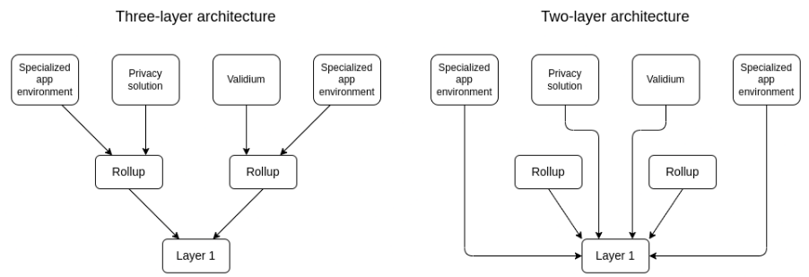

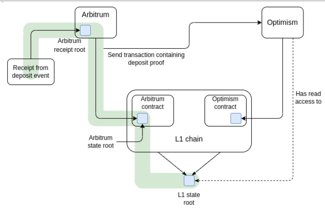

## Data Availability Overview

> In order to recreate the **state**, transaction data is needed, the data availability question is where this data is stored and how to make sure it is available to the participants in the system

---

## ZK Stack

- A modular, open-source framework that is both free and designed to build custom validity proof secured L2s and L3s
- Create a hyperscalable unified liquidity network

### Hyperchains

- Rollups have validating bridges that are trustless
- Hyperbridges can easily burn and mint assets for transfers between members of the ecosystem
- The L1 serves as a single source of truth
- Rollups cannot hard fork
- The ecosystem can coordinate a hard fork together in case a vulnerability is found using a governance framework on L1
- **Ensures zero additional trust/security assumptions**

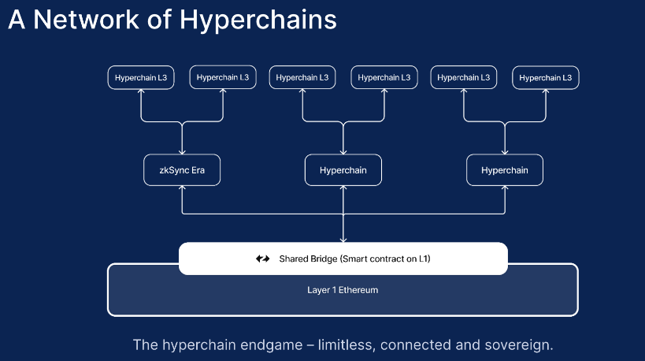

#### Characteristics of Hyperchains

- Can be developed and permissionlessly deployed by anyone
- Must be powered by the same zkEVM engine available on the ZK Stack
- All the ZKP circuits will thus remain 100% identical, letting Hyperchains fully inherit their security from L1, no matter who deployed the,

## Aggregating proofs

- Downside is it does not allow fast messaging as proofs are settled infrequently on L1

### Layering

- Hyperchains can settle their proof on an L2 Hyperchain, becoming L3s
- L3s settling on the same L2 will have faster messaging between each other and will have cheap atomicity via transactions forced through the L2
- A good solution for Validiums, which do not send data to L1
- Proof aggregation happens via the L2
- This method is ultimately not scalable, as the L2 VMs will be bottleneck for proof verification

### Layered Aggregation

- The L2s VM is replaced by the minimal program required to run L3 with messaging, and this is proven in a specialized proof tgatr allows aggregation
- This program tracks the State Root of the participating rollups, as well ass the Transaction Root.
- The Transaction Root will be imported from and settled inside this specialized proof

## Customization of the ZK Stack

### Sequencing transactions

1. **Centralized Sequencer** - There will be a single
centralized operator with a conventional REST API to accept
transactions from users
2. **Decentralized Sequencer** - A Hyperchain will
coordinate on what transactions are included in a block using a consensus algorithm
3. **Priority Queue** - This simply means the absence of any sequencer: all transactions can be submitted in batches via the priority queue from an underlying L2 or even L1 chain, taking advantage of their stronger censorship resistance
4. **External Protocol** - The sequencing of the Hyperchain is freely customizable, so external protocols such as Shared Sequencers and Shared Builders can also be used

#### Data Availability

Each Hyperchain can manage its own data availability policy by using a smart contract interface:

##### Policy Choices

1. zkRollup
2. zkPorter
3. Validium
4. Based zkRollup
5. zkRollup (self-hosted)

### Hyperbridges

- Allows Hyperchains to cheaply and trustlessly interoperate
- Allow passing of messages and assets between chains
  - Requires L1 assets to be lodged in a shared bridge on L1
- Better to have L3s settle on L2, so bridging is faster:

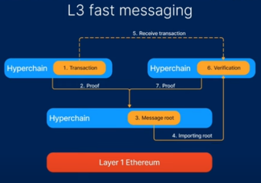

- Blocks and proofs of different Hyperchains are first aggregated across multiple chains, then the proofs of the L2 are aggregated across time

---
*Ref*

- [L3s / Hyperchains - zkSync Presents zkEVM Bootcamp - Monday, Week 3](https://www.youtube.com/watch?v=Cjse_ZSFIKE)
- [Fractal Scaling](https://polynya.mirror.xyz/EL69tiTzl05WO8ZvQXR39odgq2GQ9FV1WGSiLA49kSk)
- [How Do L2 Rollups and L3 Application Chains Serve Decentralized Applications?](https://mixmarveldaoventure.medium.com/how-do-l2-rollups-and-l3-application-chains-serve-decentralized-applications-c6ca50a58035)
- [Data availability](https://ethereum.org/en/developers/docs/data-availability/)
- [What the heck is a Zero-Knowledge Proof, anyway?](https://www.zkcamp.xyz/blog/what-is-a-zkp-anyway)
- [Preparing the ecosystem for multiple chains](https://blog.oplabs.co/preparing-the-ecosystem-for-multiple-chains/)
- [Elliptic Curves: Cheat Sheet](https://hackmd.io/@timofey/rJ8HP8Yaj)
- [Pairing Programming](https://crypto.stanford.edu/pbc/notes/ep/)

---
---

## **`w3.d2` - Privacy in Layer 2**

## Privacy Techniques

### Obfuscation

- One way functions as hash functions provide a way to obfuscate a pre image thanks to the hiding property of the commitment scheme

### Confidential Computing from Intel

- Focusing on hardware assisted solutions such as trusted execution environments, these are used more for centralized systems

### FHE

- Fully homomorphic encryption allows us to perform operations on encrypted data as if it were plain text
- Permit in theory to encrypt the state of the blockchain and perform operations on the encrypted data to produce a new encrypted state
- The owner of the state would have the encryption key and could therefore decrypt the state
- Used by [Zama](https://www.zama.ai/) and [Aztec](https://aztec.network/)

### Commitment Schemes and Nullifiers

> Allows ownership and transfer of assets to be maintained without revealing ownership

#### Commitments

- Commitments to items are added to a data structure such as a merkle tree
- The commitment hides details of the asset and the owner of the asset
- When the asset is transferred, the commitment is 'cancelled' by the user of a nullifier and a new commitment created with the new owner
- The presence of the nullifier indicates that the asset from which it has been derived has been spent
- Used by ZCash and Tornado Cash

### Projects

- [Zama](https://www.zama.ai/)
- [Aztec](https://aztec.network/)
- [Namada](https://namada.net/)
- [Obscuro](https://obscu.ro/)
- [Penumbra](https://penumbra.zone/)
- [Anoma](https://anoma.net)

## Aztec Presentation

- pdf slides in `/notes` folder

**Privacy** -> All aspects of a transaction remain hidden from the public or thrid parties

**Confidentiality** -> The I/O of a transaction are hidden from the public but the transaction parties remain public

**Anonymity** -> The I/O of a transaction are public but the transaction graph is obscured from one transaction to the next, preventing the identification of the transaction parties

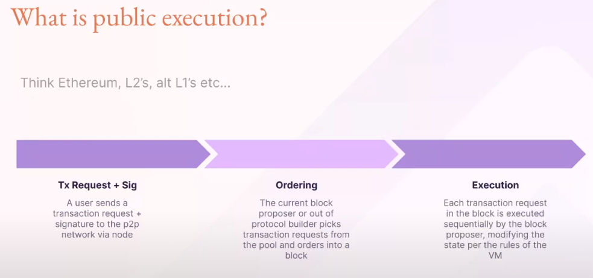

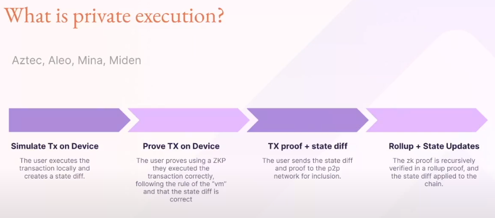

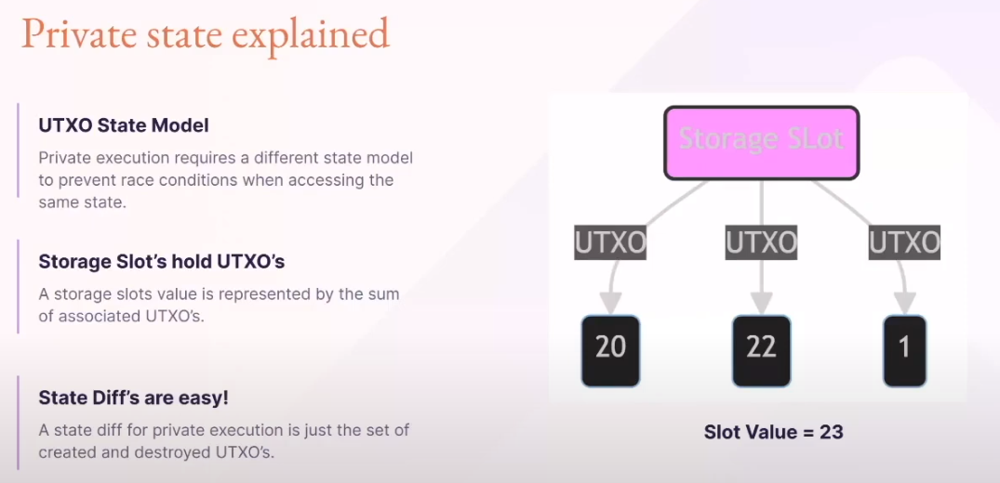

---
*Ref*

- [You can't understand ZKPs without understanding polynomials](https://www.zkcamp.xyz/blog/you-cant-understand-zkps-without-understanding-polynomial)
- [Tornado Cash Ep1. Finite Fields | Mathematical Structure for Cryptography](https://www.youtube.com/watch?v=4dpCwJsuozY)
- [How Tornado Cash Works (Line by Line for Devs)](https://www.rareskills.io/post/how-does-tornado-cash-work)
- [Exploring Vulnerabilities: The zkSNARK Malleability Attack on the Groth16 Protocol](https://medium.com/@cryptofairy/exploring-vulnerabilities-the-zksnark-malleability-attack-on-the-groth16-protocol-8c80d13751c5)
- [After scalability, privacy is the next big thing in the blockchain space](https://cointelegraph.com/news/after-scalability-privacy-is-the-next-big-thing-in-the-blockchain-space)
- [ZK-kit](https://zkkit.pse.dev/)

---
---

## **`w3.d3` - What are zkEVMs Part I**

## The EVM

> EVM is stack based

- The opcode of the EVM needs to interact with Stack, Memory, and Storage during execution. There should also be some contexts, such as gas/program counter, etc
- Stack is only used for Stack access, and Memory and Storage can be accessed randomly
- A zkEVM would seek to emulate all of these components and their interactions and create proofs that the interactions were correct

## zkVM

1. zk Proof
2. VM

### Two components

1. A compiler that can compile high-level languages such as C++ and Rust into intermediate (IR) expressions for the ZK system to perform
2. An ISA (Instruction Set Architecture) framework

## zkEVM Introduction

- Ethereum Virtual Machine (EVM) by recreating all existing EVM opcodes for transparent deployment of existing Ethereum smart contracts
- The zkEVM, acts as a state machine, processes state transitions stemming from the execution of Ethereum's Layer 2 transactions, which users transmit to the network
- After this, it generates validity proofs that confirm the accuracy of the off-chain state change computations

### zkEVM Phases

#### Proof focused

- Circuit creation
- Setup
  - Parameters created - gives proving key and verification key
- Proof creation
- Proof aggregation
- Proof acceptance on L1 and verification

#### Processes

1. Submit data to the DA layer
2. Allow L1 <-> L2 messaging
3. Provide an escape hatch via forced transactions

### zkEVM Workflow

- Receive a transaction
- Execute the relevant bytecode
- Make state changes and transaction receipts
- Using the zkEVM circuits with the execution trace as input produce a proof of correct execution
- Aggregate proofs for a bundle of transactions and submit them to L1
- Submit data to the appropriate DA layer

### zkEVM Proving System

- The prover is responsible for ensuring that all the rules for a transaction to be valid are enforced, otherwise the proof would have no meaning
- The circuit / proof is for any general contract, and not specific to a particular application such as a DEX

#### Checks

1. The contract has been loaded correctly
2. The transaction signatures are correct
3. The changes in state are correct
4. The execution proceeded correctly

## zkEVM Approaches

## zkEVM Projects

## [Scroll](https://scroll.io/)

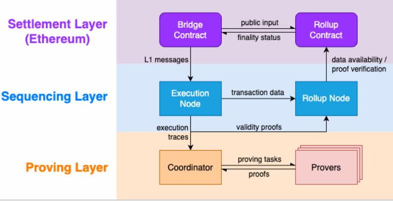

### Settlement Layer

This layer ensures data availability and ordering for the primary Scroll
chain. It also validates validity proofs and enables users and decentralized applications to exchange messages and assets between Ethereum and Scroll. Ethereum serves as the Settlement Layer, and we deploy the bridge and rollup contracts onto the Ethereum platform

### Sequencing Layer

Transactions submitted to the Scroll sequencer and those submitted to the L1 bridge contract. It produces L2 blocks. Additionally, it includes a Rollup Node that batches transactions, publishes transaction data and block information to Ethereum for data availability, and submits validity proofs to Ethereum for finality

### Proving Layer

This layer consists of a pool of provers with the task of generating zkEVM
validity proofs that verify the correctness of L2 transactions. A coordinator manages the dispatch of proving tasks to the provers and relays the resulting proofs to the Rollup Node for finalization on the Ethereum network

## [Polygon zkEVM](https://polygon.technology/polygon-zkevm)

> "The Trusted Sequencer reads transactions from the pool and decides whether to discard them or order and execute them. Transactions that have been executed are added to a transaction batch, and the Sequencer's local L2 State is updated.
>
> Once a transaction is added to the L2 State, it is broadcast to all other zkEVM nodes via a broadcast service. It is worth noting that by relying on the Trusted Sequencer, we can achieve fast transaction finality (faster than in L1). However, the resulting L2 State will be in a trusted state until the batch is committed in the Consensus Contract."

### Proof Process

## [zkSync](https://zksync.io/)

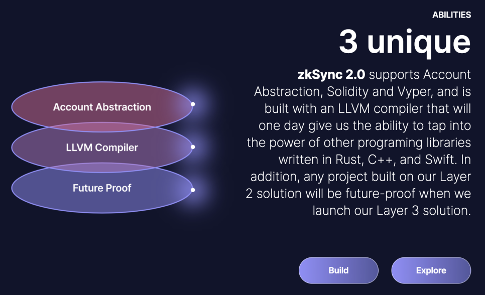

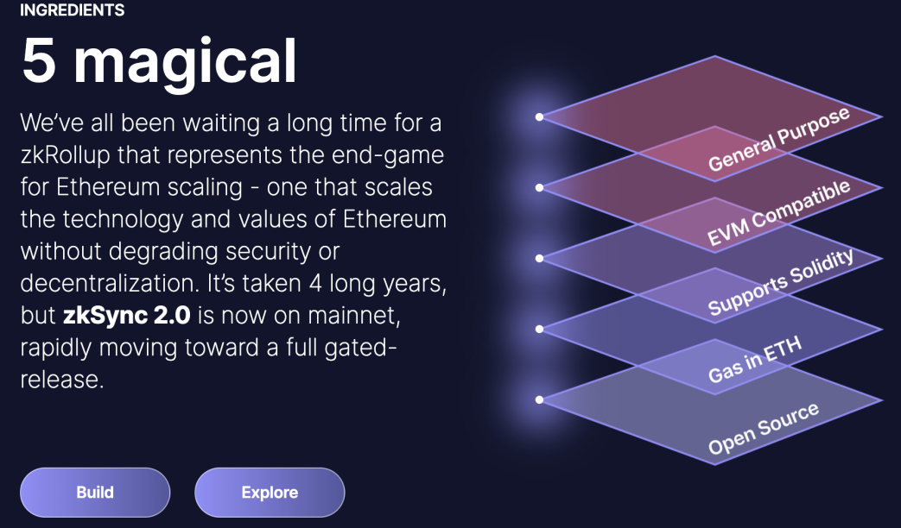

## [Starknet](https://www.starknet.io/en)

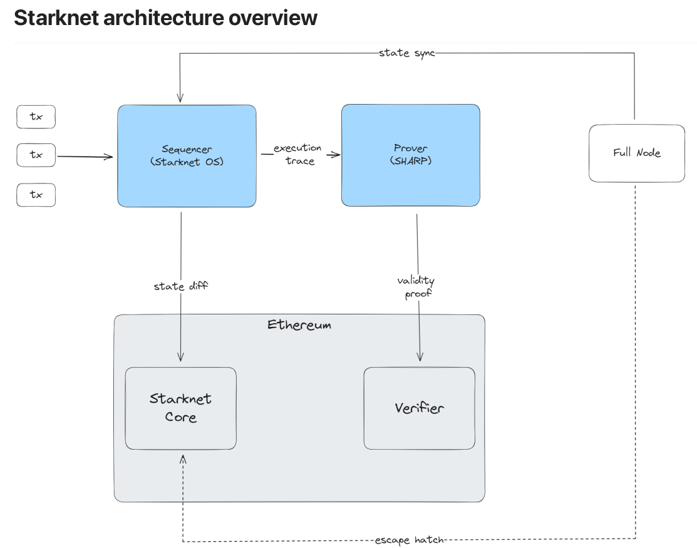

## Components

1. **Prover** - A separate process that receives the output of Cairo programs and generates STARK proofs to be verified. The Prover submits the STARK proof to the verifier that registers the fact on L1.
2. **StarkNet OS** - Updates the L2 state of the system based on transactions that are received as inputs. Effectively facilitates the execution of the (Cairo-based) StarkNet contracts. The OS is Cairo- based and is essentially the program whose output is proven and verified using the STARK-proof system. Specific system operations and functionality available for StarkNet contracts are available as calls made to the OS
3. **StarkNet State** - The state is composed of contracts’ code and contracts storage
4. **StarkNet L1 Core Contract** - This L1 contract defines the state of the system by storing the commitment to the L2 state. The contract also stores the StarkNet OS program hash – effectively defining the version of StarkNet the network is running. The committed state on the L1 core contract acts as provides as the consensus mechanism of StarkNet, i.e., the system is secured by the L1 Ethereum consensus. In addition to maintaining the state, the StarkNet L1 Core Contract is the main hub of operations for StarkNet on L1. 
    1. _Specifically_: 
		1. It stores the list of allowed verifiers (contracts) that can verify state update transactions
		2.  It facilitates L1 ↔ L2 interaction
5. **Starknet Full Nodes** -  Can get the current state of the network from the sequencer. If the connection between the Sequencer and the Full Node fails for some reason, you can recreate the L2 current state by indexing date from the Starknet L1 Core Contract independently

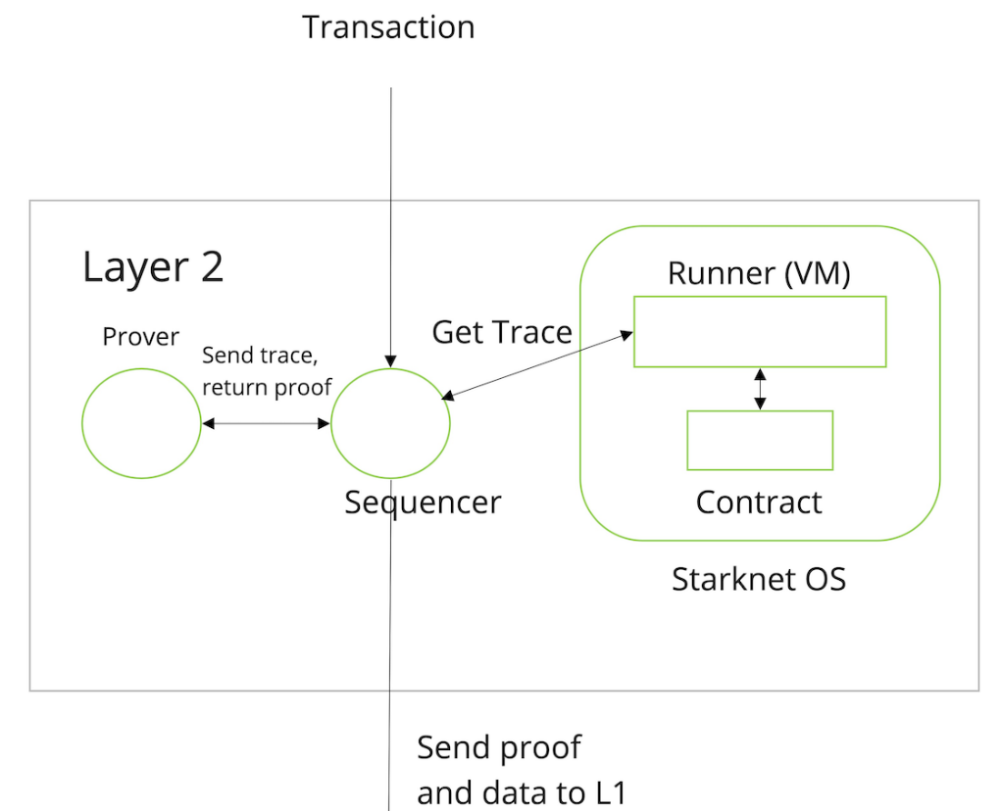

## Arithmetic Circuit Introduction

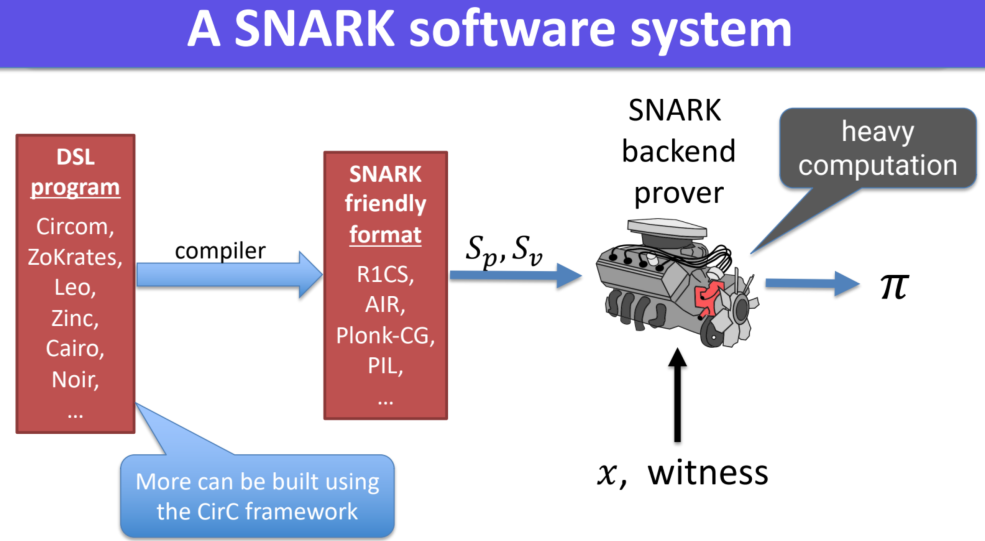

- One way to represent our DSL
- They are represented as a rank-1 constraint system, which is the next stage in the creation of the proof

### Gates

- A number of addition and multiplication gates
- These elements can be combined to represent any polynomial
- Represented by a row in the table

#### Hardware Circuit

---
*Ref*

- [zkEVM](https://scroll.io/blog/zkEVM)
- [The Architecture of Virtual Machines](https://www.cs.nmt.edu/~doshin/t/s10/cs589/pub/10.SmithComputer05.pdf)
- [An overview of Scroll's architecture](https://scroll.mirror.xyz/nDAbJbSIJdQIWqp9kn8J0MVS4s6pYBwHmK7keidQs-k)
- [The different types of ZK-EVMs](https://vitalik.eth.limo/general/2022/08/04/zkevm.html)
- [Starknet’s Architecture Review](https://david-barreto.com/starknets-architecture-review/)
- [Starknet-Tech-Stacks-Mindmap](https://github.com/0xAsten/Starknet-Tech-Stacks-Mindmap#starknet-tech-stacks-mindmap)
- [Plonky2](https://polygon.technology/blog/introducing-plonky2)
- [STARK vs SNARK](https://deeprnd.medium.com/stark-vs-snark-ada6b2d00e08)
- [State Proof](https://github.com/privacy-scaling-explorations/zkevm-specs/blob/master/specs/state-proof.md)
- [EVM Proof](https://github.com/privacy-scaling-explorations/zkevm-specs/blob/master/specs/evm-proof.md)
- [Circuits for zkEVM](https://github.com/privacy-scaling-explorations/zkevm-circuits)
- [Zkevm Specifications](https://github.com/privacy-scaling-explorations/zkevm-specs)

---
---
## **`w3.d4` - What are zkEVMs Part II**
